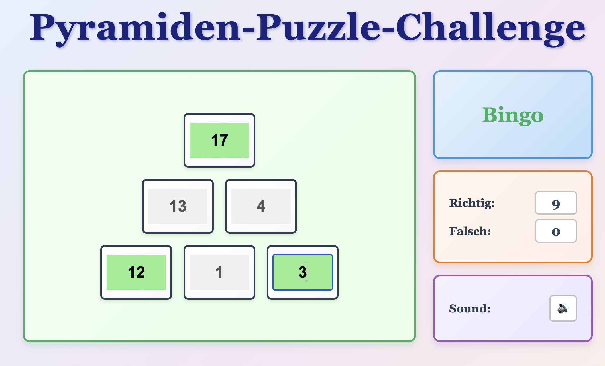

# Pyramiden-Puzzle-Challenge

A browser-based math game that teaches addition through number wall puzzles.

## How to Play

1. Open `index.html` in your web browser
2. You'll see a pyramid with 6 numbered positions arranged in 3 rows
3. Three numbers are hidden - fill them in by typing in the input boxes
4. Each brick equals the sum of the two bricks below it
5. Press Enter or click away from an input to check your answer
6. Get immediate feedback in German with animated messages and sound effects
7. Use the speaker button (🔊) to toggle sound on/off
8. A new puzzle generates automatically after 2 seconds

## Game Rules

- Numbers range from 0 to 20
- Each level of the pyramid follows addition: bottom numbers add up to the level above
- Three positions are randomly hidden in each puzzle
- Only positive whole numbers are accepted

## Scoring

Your performance is tracked during your session:
- **Richtig**: Count of correct answers
- **Falsch**: Count of incorrect answers

Scores reset when you reload the page.

## Requirements

Any modern web browser with Web Audio API support - no installation needed.

**Audio Note**: Due to browser security policies, sound effects activate after your first interaction with the game (clicking in an input field or pressing a key). This is normal behavior for web audio.
